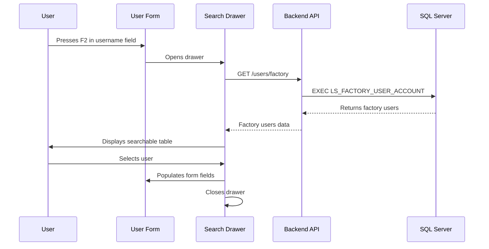

# Factory User Lookup Design

## Architecture Overview

This feature introduces a factory user lookup system that integrates with the existing user management workflow. The solution spans both backend and frontend systems, following the established patterns in the codebase.

## System Components

### Backend Integration

- **Service Layer**: New method in `UsersService` to call `LS_FACTORY_USER_ACCOUNT` stored procedure
- **Controller Layer**: New GET endpoint `/users/factory` with JWT authentication
- **Data Transfer**: FactoryUserDto for type-safe data transfer

### Frontend Integration

- **Data Layer**: New TanStack Query hook for factory users data
- **UI Layer**: Slide-out drawer component with TanStack Table
- **Form Integration**: F2 keyboard shortcut and auto-population logic

## Technical Decisions

### Stored Procedure Integration

**Decision**: Use TypeORM's `query()` method to call the stored procedure directly
**Rationale**:

- Minimal overhead for simple procedure calls
- Maintains existing database connection configuration
- Avoids complex entity mapping for read-only operations

**Alternative Considered**: Create dedicated FactoryUser entity
**Rejected**: Unnecessary complexity for read-only data access

### Frontend State Management

**Decision**: Use TanStack Query for factory users data
**Rationale**:

- Consistent with existing data fetching patterns
- Built-in caching and error handling
- Automatic background refetching capabilities

**Alternative Considered**: Local state management
**Rejected**: Would lose caching benefits and consistency with other data fetching

### UI Component Design

**Decision**: Right-side slide-out drawer with TanStack Table
**Rationale**:

- Non-intrusive UI pattern that doesn't disrupt form workflow
- Leverages existing table component patterns
- Provides good UX for search and selection workflows

**Alternative Considered**: Modal dialog
**Rejected**: More disruptive to user workflow, less space for table display

## Data Flow

## Security Considerations

### Authentication

- Factory user endpoint requires JWT authentication (same as other user endpoints)
- No additional authorization required as factory data is read-only reference data

### Data Validation

- Backend validates procedure response structure
- Frontend validates data before form population
- Type safety through TypeScript interfaces

## Performance Considerations

### Caching Strategy

- TanStack Query with 5-minute stale time for factory users
- Background refetch on window focus
- Manual refresh capability in drawer

### Database Optimization

- Stored procedure should be optimized for performance
- Consider pagination if result set is large
- Index recommendations for procedure queries

## Error Handling

### Backend Errors

- Procedure execution failures return 500 with appropriate message
- Database connection issues handled gracefully
- Logging for debugging procedure issues

### Frontend Errors

- Network errors displayed in drawer with retry option
- Empty state when no factory users available
- Graceful fallback to manual entry if lookup fails

## Accessibility

### Keyboard Navigation

- F2 key opens drawer (standard convention)
- Tab navigation within drawer
- Escape key closes drawer
- Enter key selects user in table

### Screen Reader Support

- Proper ARIA labels for drawer and table
- Announcements for user selection
- Focus management during drawer open/close

## Future Extensibility

### Potential Enhancements

- Advanced filtering in factory user search
- Multiple user selection for bulk operations
- Integration with other reference data lookups
- Customizable field mapping

### Scalability Considerations

- Drawer component designed for reuse with other lookup types
- Service pattern can be extended for additional procedures
- Table component supports various data types

## Implementation Risks

### Technical Risks

- **Stored Procedure Dependencies**: Procedure must exist and return expected schema
- **Performance**: Large result sets could impact UI responsiveness
- **Browser Compatibility**: F2 key handling across different browsers

### Mitigation Strategies

- Add procedure existence validation
- Implement pagination for large datasets
- Test keyboard shortcuts across target browsers
- Provide fallback manual entry option
